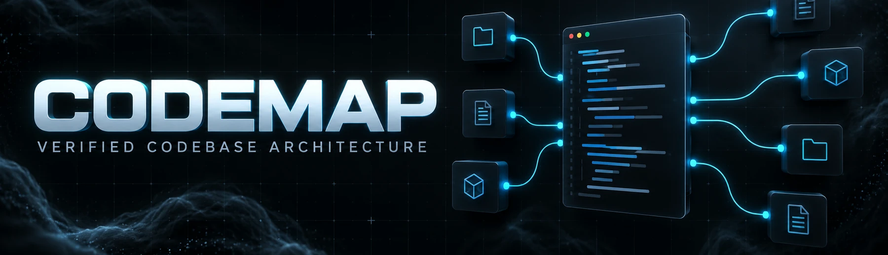

# CodeMap

CodeMap turns JavaScript, TypeScript, and Python repositories into deterministic, interactive dependency maps. Every edge comes from source parsing; unresolved imports stay unresolved instead of being guessed.



## What it includes

- A keyless CLI that analyzes a local folder or public GitHub repository.
- A self-contained HTML report with pan, zoom, search, module grouping, dependency/dependent highlighting, and file details.
- A versioned JSON graph containing languages, modules, routes, verified edges, unresolved imports, skipped files, and coverage.
- Installable skills for Codex and Claude Code.
- The complete optional Next.js application with Clerk, Supabase, OpenAI, and LangSmith integration.

## Keyless CLI

The architecture report does **not** require Clerk, Supabase, OpenAI, or LangSmith credentials.

```bash
git clone https://github.com/SSDeb-RR/CodeMap.git
cd CodeMap
pnpm install

pnpm codemap
pnpm codemap /path/to/project
pnpm codemap https://github.com/owner/repository
pnpm codemap /path/to/project --out /path/to/report
```

The default output is:

- `codemap-output/index.html` — a standalone interactive report.
- `codemap-output/graph.json` — the validated machine-readable graph.

Public GitHub URLs are shallow-cloned into a temporary directory that is removed after analysis. Supported source languages are JavaScript, TypeScript, and Python. Unsupported-only repositories fail clearly.

## Install the skills

Install both user-level skills from a clone:

```bash
./scripts/install-skills.sh
```

This installs `$codemap` for Codex under `${CODEX_HOME:-~/.codex}/skills/codemap` and for Claude Code under `~/.claude/skills/codemap`. Existing installations are never overwritten; pass `--force` to replace them.

Claude Code can also install CodeMap as a plugin directly from GitHub:

```text
/plugin marketplace add SSDeb-RR/CodeMap
/plugin install codemap@codemap-marketplace
```

Then ask either agent to “use `$codemap` on the current project” or provide a public GitHub URL. See [Skill installation and API keys](docs/SKILL_INSTALLATION.md) for complete setup and security guidance.

## Optional web application

The full application requires Node.js, pnpm, and service credentials. Create a private local environment file without placing secrets in prompts:

```bash
./scripts/configure-env.sh
# edit .env.local with your own credentials
pnpm dev
```

The required variable names remain documented in `.env.example`. The helper refuses to overwrite an existing `.env.local`. Never commit that file or paste secrets into Codex or Claude Code.

## Development

```bash
pnpm install
pnpm test:codemap
pnpm lint
pnpm build
```

The authenticated application is intentionally separate from the keyless CLI and skill workflow.
